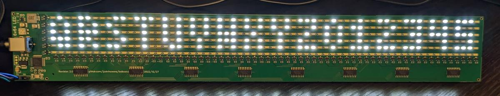

LED Board
=========

This was an educational project I undertook to learn more about PCB design and
programming microcontrollers. The design goal was to produce a low cost
alphanumeric display easily readable from 50ft outdoors in bright sunlight.

TL;DR:

* [Schematic](prod/v020-SCHEMATIC.pdf)
* [Layout](prod/v020-LAYOUT.pdf)
* [Firmware](firmware.c), [Startup Code](start.s), and [Linker Script](link.ld)
* [Driver](driver.py)
* [Gerber](prod/v020-GERBER.zip), [BOM](prod/v020-BOM.csv), and [CPL](prod/v020-CPL.csv)

Design
------

The LEDs are wired in parallel, with P-channel MOSFETs on the rows and N-channel
MOSFETs on the columns. The screen runs at a refresh rate of 1.25KHz, or a row
scan of 7.5KHz, with the goal of avoiding rolling shutter artifacts in photos
and videos. An ARM Cortex M0 drives shift registers to control the columns using
its SPI peripheral, and switches the rows with dedicated GPIOs.

The board is programmed via a TTL UART, with a 48 byte LSB-first row major
representation of the pixels on the board, left to right.

The [driver.py](driver.py) script is an example of how to drive the display. The
font in [ledfont.py](ledfont.py) is the 4x6 terminal font from the Linux kernel.

Datasheets:

* ARM M0 [STM32F030C8T6](https://datasheet.lcsc.com/lcsc/1811061717_STMicroelectronics-STM32F030C8T6_C23922.pdf) (see also [RM0360](https://www.st.com/resource/en/reference_manual/dm00091010-stm32f030x4-x6-x8-xc-and-stm32f070x6-xb-advanced-arm-based-32-bit-mcus-stmicroelectronics.pdf))
* 12MHz Cyrstal [X322512MOB4SI](https://datasheet.lcsc.com/lcsc/2103291204_Yangxing-Tech-X322512MOB4SI_C70565.pdf)
* 3V LDO [SK1117-3.3](https://datasheet.lcsc.com/lcsc/1811021124_Shikues-SK1117-3-3_C165482.pdf)
* Switcher [MT2492](https://datasheet.lcsc.com/lcsc/1810262207_XI-AN-Aerosemi-Tech-MT2492_C89358.pdf)
* Shift Register [74HC595D-118](https://datasheet.lcsc.com/lcsc/1811021715_Nexperia-74HC595D-118_C5947.pdf)
* P-Channel MOSFET [AP2301B](https://datasheet.lcsc.com/lcsc/2104011233_ALLPOWER-ShenZhen-Quan-Li-Semiconductor-AP2301B_C2763847.pdf)
* N-Channel MOSFET [2N7002AK](https://datasheet.lcsc.com/lcsc/2109301154_YFW-2N7002AK_C2898356.pdf)
* LED [HL-A-3014H416W-S1-08HL-HR3](https://datasheet.lcsc.com/lcsc/2009021504_HONGLITRONIC-Hongli-Zhihui--HONGLITRONIC--HL-A-3014H416W-S1-08HL-HR3_C210338.pdf)

Changes
-------

Revision 2.0 realized a significant reduction in cost by replacing the expensive
open drain shift registers with N-channel MOSFETs small enough to be driven by
logic level registers. That also enabled removing the 5V level shifter and
associated 5V LDO.

The switcher inductor value was far too large, and was limiting the brightness
of the display: since ripple current isn't really relevant, I replaced it with
the smallest inductor the switcher IC datasheet allows (22uH -> 4.7uH).

The PCB footprint was reduced from 365x50mm to 350x50mm.

Ordering PCBs
-------------

I had 5 revision 2.0 boards manufactured and assembled by JLCPCB in December
2022: the cost was $24.50/each, plus $30 in shipping costs.

Revision 2.1 will use cheaper more widely available LEDs.

Adjustable voltage wall adapter: https://www.amazon.com/dp/B01ISM267G

Building Firmware
-----------------

No external libraries are necessary: everything is included here, and can be
flashed using standard open source tools.

To build on Debian/Ubuntu, run:

	sudo apt install make gcc-arm-none-eabi openocd
	make

To flash to the hardware, attach the ST-LINK and run:

	./flash.sh

Attach GDB with:

	gdb-multiarch ./ledboard.elf -ex 'target extended-remote localhost:3333'

ST-LINK: https://www.amazon.com/gp/product/B01J7N3RE6

License
-------

The license for the header files from STMicro can be found at include/LICENSE.
Everything else is CC0 licensed, see LICENSE in this directory.

THE SOFTWARE IS PROVIDED "AS IS", WITHOUT WARRANTY OF ANY KIND, EXPRESS OR
IMPLIED, INCLUDING BUT NOT LIMITED TO THE WARRANTIES OF MERCHANTABILITY,
FITNESS FOR A PARTICULAR PURPOSE AND NONINFRINGEMENT. IN NO EVENT SHALL THE
AUTHORS BE LIABLE FOR ANY CLAIM, DAMAGES OR OTHER LIABILITY, WHETHER IN AN
ACTION OF CONTRACT, TORT OR OTHERWISE, ARISING FROM, OUT OF OR IN CONNECTION
WITH THE SOFTWARE OR THE USE OR OTHER DEALINGS IN THE SOFTWARE.
